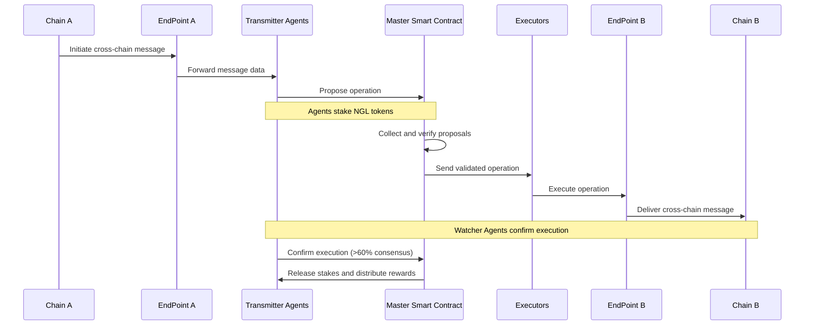

# Entangle

**Entangle** is a decentralized protocol facilitating seamless cross-chain communication and interaction among various blockchain networks. The primary problem it addresses is the fragmentation of assets and information across multiple blockchains, which limits interoperability and usability. By enabling secure and efficient communication between different blockchains, Entangle aims to create a more interconnected and accessible decentralized ecosystem, allowing users to transfer assets and data without being constrained by the limitations of individual blockchain environments.

**Entangle Interoperable Blockchain**

Entangle Consists of three layers:

- Application Layer
- Modules Layer
- Tendermint Consensus Layer

**Application Layer**

The Application Layer decodes, validates, and redirects messages to designated Modules, enabling the development of smart contracts, dApps, and other software on the blockchain network. It serves as the user interface, allowing direct interaction between consumer devices and the blockchain.

This layer includes scripts, APIs, user interfaces, frameworks, smart contracts, and dApps. It is divided into execution and application layers:

- The execution layer handles smart contracts, foundational rules, and chaincode, validating and executing transactions initiated at the application layer.
- The application layer delivers blockchain-based applications to end-users, offering functionalities such as wallets, lending, and staking. At its core, the smart contract dictates state transitions, with user interactions mediated through Web3 applications or APIs.

**Entangle Photon Messaging**

Entangle Photon Messaging is an omnichain protocol designed to facilitate secure and efficient cross-chain communication for both EVM and non-EVM blockchains. It enables developers to send customized messages across diverse blockchain networks, supporting seamless asset transfers and operations. It operates using a Delegated Proof of Stake (DPoS) distributed architecture and off-chain machines known as Transmitter Agents and Watcher Agents, ensuring high data integrity and optimized performance.

Key components of the protocol include:

1. **Entangle Agent Network**: A Delegated Proof of Stake (DPoS) distributed architecture with off-chain machines consisting of Transmitter Agents and Watcher Agents that manage event detection, data integrity, and ensure the flow of messages across chains.
2. **Master Smart Contract (MSC)**: Manages protocol settings and ensures data integrity by managing, verifying, and executing operations between blockchains.
3. **End Points**: Smart contracts serving as gateways for cross-chain messages, managing and verifying transactions between different blockchain networks.
4. **Executors**: Execute operations on the designated blockchain after receiving validated proposals from Transmitters.
5. **Photon Data Streamer**: Optimized for real-time data transmission to enable immediate processing and analysis across various applications.

## **Entangle Architecture**

Process Flow

- The process begins on Chain A, where a cross-chain message is initiated.
- The message is sent to the End Point smart contract on Chain A.
- The End Point forwards the message data to the Transmitter Agents in the Entangle Agent Network.
- Transmitter Agents propose the operation to the Master Smart Contract (MSC), staking NGL tokens to back their proposals.
- The MSC collects and verifies the proposals from multiple Transmitters.
- Once consensus is reached, the MSC sends the validated operation to the Executors.
- Executors execute the operation on the End Point smart contract of Chain B.
- The End Point on Chain B delivers the cross-chain message to its final destination on Chain B.
- Watcher Agents (which are Transmitter Agents in this round) confirm the execution of the operation.
- When majority of the Watchers confirm the execution, this information is sent back to the MSC.
- Finally, the MSC releases the staked tokens and distributes rewards to the participating Transmitter Agents.

## **Architectural Advantages**

1. Interoperability: Supports both EVM and non-EVM chains, enabling seamless communication across diverse blockchain ecosystems.
2. Flexibility: Allows customization of consensus mechanisms and data processing algorithms to suit specific requirements of each protocol.
3. Real-time data handling: The Photon Data Streamer optimizes for immediate processing and analysis of streaming data.
4. Security: Implements a multisig consensus model and stake-based incentives to ensure data integrity and prevent malicious behavior.

## **Architectural Disadvantages**

1. Complexity: The multi-layered architecture with various components may increase the learning curve for developers and potential points of failure.
2. Dependency on off-chain components: Relies on Transmitter and Watcher Agents, which could potentially introduce latency, and centralization risks if not properly distributed.
3. Potential for congestion: As the number of supported chains and protocols grows, there may be challenges in managing the increased load on the Master Smart Contract and Executors

Photon messaging falls under the **Hybrid Settlement** category. It involves a combination of off-chain (Transmitter and Watcher Agents) and on-chain (MSC, End Points) processes to ensure message validation, execution, and settlement. This hybrid approach enhances both security and scalability while maintaining efficiency across diverse blockchain networks.

Entangle Photon Messaging falls under the category of a **hybrid** settlement solution. It combines elements of both external and native settlement approaches:

1. External aspects:
    - Uses off-chain Transmitter and Watcher Agents for data collection and verification.
    - Implements a separate consensus mechanism (DPoS) for cross-chain communication.
2. Native aspects:
    - Deploys End Point smart contracts on each supported blockchain for direct interaction with the native environment.
    - Executors perform operations directly on the target blockchains using native transactions.

This hybrid approach allows Entangle to leverage the benefits of both external coordination and native execution, potentially offering a balance between security, efficiency, and blockchain-specific optimizations.

