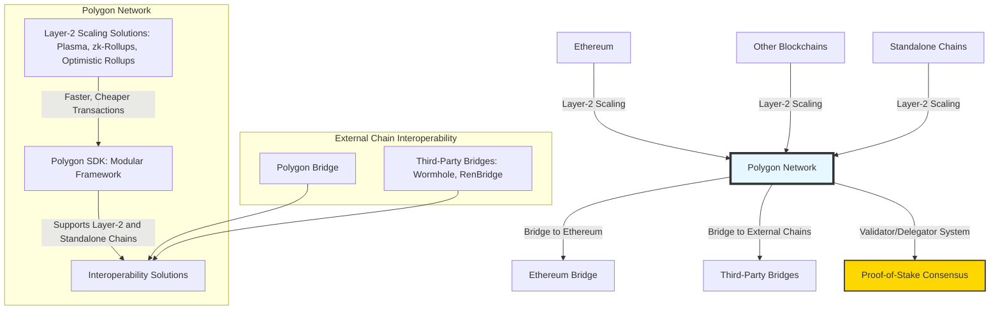

# Polygon PoS

Polygon PoS is a commit chain built to address Ethereum's scalability and high transaction costs. It operates as a multi-chain system, often referred to as "Ethereum's Internet of Blockchains," aiming to provide a framework for building interconnected blockchain networks. By offering faster transactions and reduced fees, Polygon allows developers to create scalable decentralized applications (dApps) that maintain security and interoperability with Ethereum.

---

- **Bridge to Ethereum**: Allows seamless asset transfers between Polygon and Ethereum, ensuring interoperability and capital flow between both networks.
- **Validators and Delegators**: Security is provided by a Proof-of-Stake (PoS) consensus mechanism, where validators validate transactions, and delegators stake tokens with validators.
- **Governance**: Community-led governance through token voting, with Polygon's treasury supporting ecosystem development and innovation.

---

## Interoperability Solutions

Interoperability is central to Polygon’s strategy, allowing developers to build applications that can interact across different blockchains. By supporting multiple bridges and interoperability mechanisms, Polygon ensures that assets and data can flow seamlessly between its ecosystem and other networks. These interoperability solutions can be categorized by their unique characteristics:

### Polygon Bridge

The official **Polygon Bridge** is designed for efficient asset transfers between Ethereum and Polygon. It utilizes a dual-consensus architecture to optimize the trade-off between speed and decentralization:

- **Decentralization**: The bridge is secured by Polygon’s validators, ensuring the integrity of cross-chain transfers.
- **Cost**: Fees on the Polygon side are significantly lower compared to Ethereum, making cross-chain interactions cheaper.
- **Speed**: With the ability to process up to 65,000 transactions per second (TPS), the Polygon Bridge vastly improves upon Ethereum’s 14 TPS, offering faster finality times.

---

## Bridge Blockchains and Settlement

Polygon’s approach to bridging focuses on the direct interaction with Ethereum, ensuring a high level of security and simplicity in the asset transfer process:

1. **Direct Settlement**: The Polygon Bridge directly locks assets on Ethereum, minting equivalent tokens on Polygon and vice versa. This minimizes intermediary risks and ensures the user maintains control of their funds.
2. **Checkpoint Mechanism**: Every 30 minutes, Polygon validators submit state checkpoints to Ethereum smart contracts. This process ensures that cross-chain transactions remain secure and tamper-resistant by anchoring Polygon’s state to Ethereum’s security.

---

## Settlement Process and User Fund Security

Polygon’s settlement process is designed with a focus on security and user protection. The system guarantees that user funds are secure throughout the cross-chain transfer:

1. **Asset Locking**: When transferring from Ethereum to Polygon, the assets are locked in a smart contract on the Ethereum network. The locked tokens are held securely during the transfer process.
2. **Minting and Burning**: Equivalent assets are minted on Polygon and transferred to the user. For reverse transfers, assets on Polygon are burned, and the original assets are unlocked on Ethereum.
3. **Checkpoint Verification**: The security of this process is enhanced by Polygon’s checkpoint mechanism, ensuring that every transaction’s validity is anchored in Ethereum’s security.

This robust security model ensures that users can trust Polygon with their cross-chain assets.

---

## Architecture

### Advantages:

1. **Scalability**: Polygon significantly improves Ethereum's throughput, enabling thousands of transactions per second (TPS), which reduces network congestion and fees.
2. **Interoperability**: The Polygon bridge ensures easy asset transfer between Polygon and Ethereum, allowing developers to create interoperable dApps.
3. **Flexible Development**: The Polygon SDK allows for the creation of multiple types of chains (e.g., Layer-2 solutions or independent chains), providing a robust framework for a wide variety of use cases.
4. **Cost Efficiency**: By offloading transactions from Ethereum to Polygon, developers and users can benefit from significantly lower transaction costs.
5. **Sustainability**: Polygon has integrated zk-rollup technology (zkEVM), which not only enhances scalability but also reduces energy consumption, improving the sustainability of the network.

### Disadvantages:

1. **Security Concerns**: Polygon’s security is partially dependent on Ethereum, but vulnerabilities in Polygon’s smart contracts or bridges could introduce risks that aren’t present in Ethereum itself.
2. **Centralization Risks**: While the network is decentralized, a limited number of validators compared to Ethereum might introduce concerns around centralization and network security.
3. **Bridge Vulnerabilities**: Cross-chain bridges, while facilitating interoperability, have been historically vulnerable to attacks, posing risks of potential asset losses.
4. **Complexity in Rollups**: Although zk-rollups and optimistic rollups are innovative, they add layers of complexity to the ecosystem, making development more challenging for teams not familiar with these technologies.
5. **Governance Challenges**: While community governance promotes decentralization, low participation rates could lead to decisions being made by a small, concentrated group, creating governance imbalances.
6. **Ecosystem Fragmentation**: The ability to build custom chains or Layer-2 solutions could lead to fragmentation of the ecosystem, where smaller networks struggle to attract sufficient users and developers.
