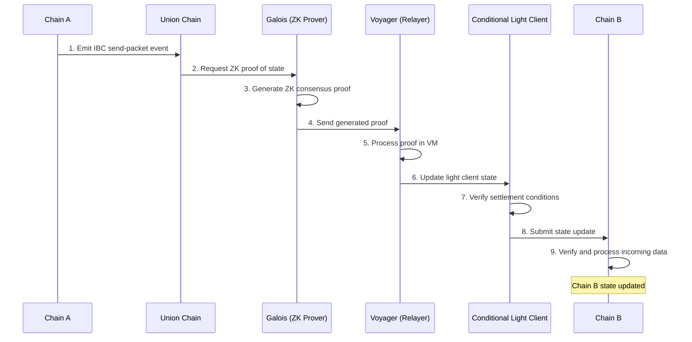

# Union

Union is a blockchain platform designed to facilitate secure and efficient cross-chain communication and bridging. It enables interoperability between different blockchain networks, including Layer 1 (L1) and Layer 2 (L2) solutions.

## Overview

Union addresses the challenges in existing cross-chain solutions, particularly:

- Security concerns in bridging
- High computational costs for consensus verification
- Slow bridging and transfer times
- Centralization risks in many existing bridge solutions

Union achieves its goals through several key innovations:

1. **CometBLS**: An improved consensus mechanism based on Tendermint, optimized for zero-knowledge proofs and efficient bridging.
2. **Galois**: A zero-knowledge consensus proving system that enables fast and low-cost proof generation.
3. **Voyager**: An in-house relayer for supporting new networks and efficient message passing.
4. **Conditional Light Clients**: Specialized light clients that can handle complex settlement conditions when bridging to L2 networks.

## Architecture

### Detailed Process Flow Steps:

- Chain A emits an IBC send-packet event to initiate the cross-chain communication.
- The Union Chain requests a zero-knowledge proof of its current state from Galois.
- Galois generates a ZK consensus proof of the Union Chain's state.
- Galois sends the generated proof to Voyager, the relayer.
- Voyager processes the proof in its virtual machine.
- Voyager updates the state of the Conditional Light Client with the new proof.
- The Conditional Light Client verifies the settlement conditions for the transaction.
- If conditions are met, the Conditional Light Client submits a state update to Chain B.
- Chain B verifies and processes the incoming data, updating its own state.

## **Architectural Advantages**

1. **Improved Scalability**: CometBLS allows the network to scale to hundreds of validators without impacting performance or bridging latency.
2. **Efficient Proof Generation**: Galois can generate consensus proofs for 128 validators within seven seconds, using only 5GB of RAM.
3. **Decentralization**: The system is designed to allow anyone to participate in proof generation and relaying, reducing centralization risks.
4. **Cost-Effective**: Union's approach significantly reduces the cost of generating and verifying proofs compared to traditional methods.
5. **Flexibility**: The use of conditional light clients allows for efficient bridging to various L2 solutions.
6. **Fast Bridging**: The combination of efficient proof generation and BLS signatures enables faster cross-chain transactions.

## **Architectural Disadvantages**

1. **Complexity**: The system involves multiple specialized components, which may increase the overall complexity of the network.
2. **Reliance on New Technologies**: Some of the technologies used, such as BLS signatures and MiMC hashing, are relatively new in the blockchain space and may require further validation.
3. **Potential Learning Curve**: The unique architecture may require developers and users to familiarize themselves with new concepts and tools.

## **Settlement Category**

Based on the provided information, Union falls under the **Hybrid** settlement category. This conclusion is drawn from the following observations:

1. **Native Elements**:
   - Union has its own blockchain with a native consensus mechanism (CometBLS).
   - It uses its own validator set for consensus and proof generation.
2. **External Elements**:
   - Union interacts with external chains (L1s, L2s, and sovereign rollups) through light clients and zero-knowledge proofs.
   - It uses conditional light clients to track and verify the state of external chains.
3. **Hybrid Approach**:
   - The combination of internal consensus (CometBLS) with external bridging capabilities (Conditional Light Clients) creates a hybrid system.
   - Union acts as an intermediary layer between different blockchain networks, facilitating cross-chain communication while maintaining its own consensus.
