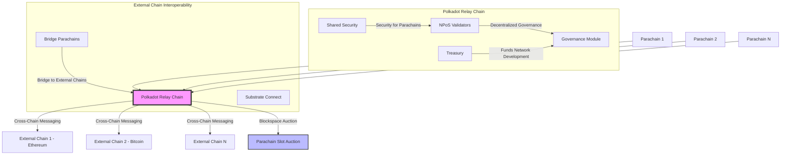

# Polkadot

Polkadot is a sharded blockchain network designed to support **application-specific Layer-1 blockchains** (parachains) running in parallel, allowing each to have unique features tailored to specific applications. This flexibility, combined with Polkadot's innovative shared security model, relay chain, and governance systems, offers a robust platform for scalable, decentralized applications.

---

- **Parachains**: Independent Layer-1 chains with tailored functions running on Polkadot's relay chain, offering flexibility without uniformity in the state transition function.
- **Shared Security**: Based on Nominated Proof-of-Stake (NPoS), allowing all parachains to inherit security from Polkadot's validators.
- **Interoperability**: Enabled by the Cross-Consensus Messaging (XCM) format, allowing seamless communication and data exchange between parachains and external blockchains like Ethereum and Bitcoin.
- **Blockspace and Auctions**: Polkadot offers "blockspace" through a competitive slot auction mechanism, where projects bid for access.
- **Governance and Treasury**: Decentralized governance via the OpenGov system, with a treasury that funds network development.

---

## Interoperability Solutions

Polkadot is designed with interoperability in mind, facilitating seamless cross-chain communication through various solutions. While Polkadot's internal interoperability is powered by **Cross-Consensus Messaging (XCM)**, the network also accommodates connections to external blockchains, enhancing the flexibility and utility of its ecosystem.

## Cross-Consensus Messaging (XCM)

XCM is Polkadot's primary protocol for enabling communication between parachains within its ecosystem. This solution eliminates the need for external bridges and improves the security and efficiency of cross-chain interactions.

- **Security**: XCM leverages Polkadot's shared security model, reducing the vulnerabilities associated with bridge hacks.
- **Efficiency**: Direct communication between parachains avoids the bottlenecks and costs of third-party solutions.
- **Flexibility**: XCM supports a wide range of cross-chain operations, beyond simple token transfers, including smart contract calls and other complex interactions.

## External Bridge Blockchains

While Polkadot prioritizes internal interoperability, it also enables connections with external networks:

- **Bridge Parachains**: These are specialized parachains that facilitate bridging between Polkadot and external blockchains such as Ethereum and Bitcoin. They settle transactions on Polkadot's relay chain, allowing users to leverage assets and functionalities across networks.
- **Substrate Connect**: A light client protocol that enhances communication between Polkadot and other chains built on Substrate, reducing overhead and improving integration with similar ecosystems.

---

## Bridge Categorization

Interoperability solutions within the Polkadot ecosystem can be categorized based on their characteristics, particularly in terms of **decentralization** vs. **cost and speed**:

1. **Decentralized Bridges**: These bridges prioritize security and trustlessness, often using smart contracts and distributed validator sets to ensure the integrity of transactions. While highly secure, they tend to be slower and more expensive due to the added complexity of decentralized processes.
2. **Centralized Bridges**: These solutions offer faster and more cost-effective transactions by relying on a centralized entity to validate and transfer assets. However, they come with higher security risks, as a centralized operator could potentially act maliciously or be compromised.
3. **Trust-Minimized Bridges**: Combining the best of both worlds, trust-minimized bridges use cryptographic techniques and cross-chain verification to reduce reliance on centralized parties without sacrificing too much in terms of speed and cost.

By employing these various bridge models, Polkadot ensures that users can choose the appropriate trade-offs based on their needs, whether they prioritize security, efficiency, or flexibility.

---

## Parachain Settlement and Security

Polkadot’s security and settlement approach is robust and designed to cater to the diverse needs of its parachains:

- **Parachain Settlement**: Each parachain is responsible for block production independently but relies on Polkadot’s relay chain for finality. This decentralized block production ensures that parachains maintain autonomy while benefiting from the network's collective security.
- **Nominated Proof-of-Stake (NPoS)**: Polkadot's security model, NPoS, balances the decentralization and scalability of Proof-of-Stake (PoS) while selecting validators in a more decentralized manner. Validators secure the relay chain and parachains alike, distributing the risk of attacks across the entire ecosystem.
- **Shared Security**: All parachains connected to Polkadot inherit security from the relay chain, significantly reducing the risks of 51% attacks on individual chains. This shared security ensures that smaller or newer parachains can operate with a high level of protection without needing to establish their own large validator set.

---

## Architecture

### Advantages:

1. **High Customization**: Parachains allow developers to create Layer-1 chains with specific features optimized for different use cases, leading to increased flexibility.
2. **Shared Security Model**: Polkadot's NPoS ensures that all parachains benefit from the network's validator security, which reduces the need for individual chains to secure themselves.
3. **Interoperability**: The XCM format enables seamless cross-chain communication, making it easy for parachains to exchange assets and data with other chains, including non-Polkadot chains like Ethereum and Bitcoin.
4. **Scalability**: Parachains running in parallel on Polkadot reduce congestion, allowing the network to scale horizontally by adding more parachains.
5. **On-Chain Governance**: OpenGov allows token holders to vote on network decisions, promoting decentralization and inclusivity in governance.
6. **Resilience**: With robust decentralization mechanisms like the 1KV validator program, Polkadot promotes both physical and social decentralization, enhancing network security.

### Disadvantages:

1. **Complexity of Parachain Development**: Creating application-specific Layer-1 chains can be complex, requiring developers to build entirely custom systems, which might be daunting for less experienced teams.
2. **Slot Auction Barriers**: The auction system for parachain slots could be a barrier for smaller projects that lack resources to outbid larger, well-funded competitors.
3. **Security Dependency**: While shared security is a strength, all parachains rely on the integrity of Polkadot’s validators. If the validator pool becomes compromised, it could pose risks to the entire ecosystem.
4. **Latency in Cross-Chain Transactions**: While interoperability is a key feature, cross-chain messaging could introduce latency and performance bottlenecks in transactions, particularly when bridging to external blockchains.
5. **Governance Overload**: OpenGov requires active participation from token holders, which might lead to decision-making delays or governance fatigue if the community becomes overwhelmed with too many proposals.
6. **Resource Distribution**: As parachains grow, the competition for blockspace could lead to inefficiencies or wastage, requiring further optimization of the auction and blockspace allocation system.
