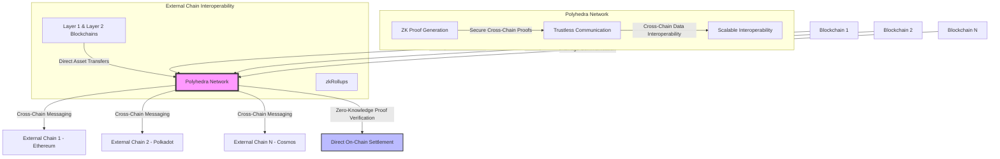

# Polyhedra

Polyhedra Network is a protocol focused on providing secure, scalable cross-chain communication and data interoperability using advanced cryptographic techniques, such as zero-knowledge proofs (ZKPs). By offering a trustless way to transfer data and assets between heterogeneous blockchains, Polyhedra aims to resolve scalability and interoperability issues plaguing multi-chain ecosystems. Its zero-knowledge-based architecture allows for fast finality, privacy-preserving transactions, and efficient asset transfers across Layer 1 and Layer 2 networks.

---

- **Zero-Knowledge Proofs (ZKPs)**: Polyhedra leverages ZKPs to ensure data integrity and security while maintaining privacy across blockchain networks.
- **Interoperability**: Facilitates trustless cross-chain communication and asset transfers using ZK rollups, connecting heterogeneous chains like Ethereum, Polkadot, and Cosmos.
- **Scalability**: ZK rollup technology improves transaction throughput while minimizing data stored on-chain.
- **Multi-Chain Support**: Polyhedra supports multiple Layer-1 and Layer-2 ecosystems, allowing for secure and scalable interoperability without compromising on security.

---

## Interoperability Solutions

Polyhedra's primary interoperability solution is **zkBridge**, which uses ZKPs to facilitate trustless cross-chain asset transfers and message passing. This approach differs from other bridge solutions in several key ways:

- **Decentralization vs. Cost and Speed**: zkBridge achieves a high level of decentralization by eliminating the need for trusted intermediaries or validator networks. Instead, it relies on cryptographic proofs to verify cross-chain transactions, enhancing security but potentially introducing latency due to proof generation and verification.
- **Trustless Nature**: Unlike bridges that rely on multi-signature schemes or validator networks, zkBridge provides trustless interoperability by leveraging ZKPs to prove the validity of cross-chain messages. This eliminates additional trust assumptions and reduces the risk of bridge failures due to compromised validators.

By categorizing bridges based on **functionality** (such as **decentralization vs. cost and speed**), Polyhedra ensures that its solutions meet the diverse needs of users while maintaining security and efficiency. The bridge options include:

1. **Decentralized Bridges**:
    These prioritize security and trustlessness, using ZKPs or distributed validator sets to ensure the integrity of transactions. Although highly secure, these solutions can be slower due to the computational complexity of zero-knowledge proof generation and verification.

2. **Centralized Bridges**:
    These offer faster and cheaper transactions by using centralized validators or intermediaries to verify and settle cross-chain transfers. However, they are less secure, as users must trust a centralized party, which increases the risk of manipulation or attacks.

3. **Trust-Minimized Bridges**:
    Combining the best aspects of both decentralized and centralized models, trust-minimized bridges use cryptographic techniques (such as ZKPs) to minimize reliance on trusted intermediaries without sacrificing performance. They aim to offer a balance between speed, cost, and security.

---

## Bridge Blockchains and Settlement

Polyhedra's zkBridge doesn’t use an intermediary blockchain for settlement. Instead, it directly proves the validity of cross-chain messages on the destination chain using ZKPs. This approach offers several advantages:

1. **Direct Settlement**: Transactions are settled directly on the target Layer 1 blockchain, reducing intermediary risks.
2. **Improved Security**: By eliminating middle-chains, zkBridge reduces potential attack vectors.
3. **Efficiency**: Direct settlement leads to faster finality times for cross-chain transactions.

---

## Settlement Process and User Fund Security

Polyhedra's settlement process focuses on ensuring user fund security through cryptographic guarantees:

1. **Proof Generation**: When a user initiates a cross-chain transaction, a ZK proof is generated to verify the transaction's validity.
2. **On-Chain Verification**: The proof is submitted to the destination chain, where it's verified by a smart contract.
3. **Asset Release**: Upon successful verification, the assets are released, or the message is processed on the destination chain.

This process ensures that user funds are only released when the validity of the cross-chain transaction is cryptographically proven, significantly enhancing security.

---

## Architecture

### Advantages:

1. **Enhanced Security**: ZKPs provide cryptographic guarantees for cross-chain communication, ensuring data integrity and privacy.
2. **Scalability**: ZK rollups increase throughput by bundling multiple transactions into a single batch, reducing the load on base layer blockchains.
3. **Trustless Interoperability**: Polyhedra allows for seamless cross-chain communication without relying on centralized intermediaries.
4. **Multi-Chain Support**: By supporting diverse Layer-1 and Layer-2 chains, Polyhedra promotes flexibility in decentralized applications.
5. **Finality and Privacy**: ZKPs enable quicker transaction finality while preserving user privacy.
6. **Reduced On-Chain Data**: The rollup model minimizes on-chain data storage, reducing gas fees and transaction costs.

### Disadvantages:

1. **High Technical Complexity**: Implementing ZK rollups and cross-chain communication protocols can be technically challenging, requiring deep expertise.
2. **Latency**: The process of generating ZK proofs and verifying them across chains could introduce latency in cross-chain transfers.
3. **Validator Centralization Risk**: If the network’s ZK validators are not widely distributed, centralization concerns could arise.
4. **Governance Overload**: Managing cross-chain governance and protocol updates across multiple ecosystems could introduce decision-making complexities.
5. **Interoperability Risks**: Bugs or vulnerabilities in the ZK rollup mechanism could lead to potential security breaches across connected chains.
