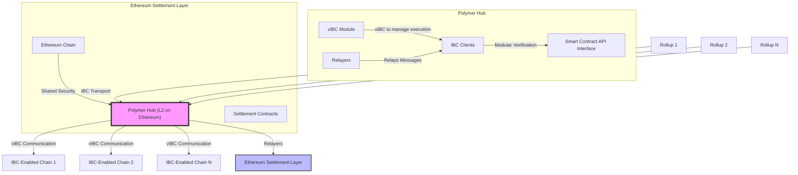

#  Polymer

## Overview

Polymer addresses the issue of **fragmentation in Ethereum's rollup ecosystem**, where different interoperability protocols exist without standardization, causing inefficient communication and scalability challenges. Existing solutions rely on VM-based protocols that are limited by their coupling with specific data structures, RPCs, and transaction formats unique to each chain, which exacerbates fragmentation. Polymer aims to **unify Ethereum rollups** by acting as an **interoperability hub** using the **Inter-Blockchain Communication (IBC) protocol**, allowing standardized communication across Ethereum rollups and extending to ecosystems like Cosmos.

Polymer introduces a **virtual IBC (vIBC)** protocol that decouples the transport layer of IBC from the application-level execution on the connected rollups, providing a scalable and standardized communication layer. This solution enables **seamless composability between applications on different chains**, creating a permissionless, open, and vibrant interoperability economy.

## Architecture

Polymer is an Ethereum Layer 2 rollup specifically designed to facilitate cross-rollup communication by leveraging IBC. Its architecture consists of several components:

1. **Virtual IBC (vIBC)**: Polymer uses vIBC to enable chains to outsource their IBC transport-level execution to Polymer while keeping the verification layer on the respective chains. This setup reduces the overhead on individual chains, allowing more efficient cross-chain communication.

2. **IBC Client Design**: Each chain has its own IBC client responsible for verifying state transitions. IBC clients allow for arbitrary verification logic, giving developers flexibility to implement various security models based on their needs.

3. **vIBC Smart Contract API Interface**: A key component of Polymer’s architecture is the vIBC core contract, deployed on connected chains. This contract acts as a post office, managing both inbound and outbound communication packets.

4. **Mesh Topology**: Polymer operates using a mesh network topology for efficient multi-hop communication between chains. Unlike the traditional hub-and-spoke model, which has a central hub, Polymer’s mesh design allows for indirect connections, improving scalability and reducing bottlenecks.

Polymer leverages Ethereum as the settlement layer for all transactions between rollups. This design ensures trust-minimized security by inheriting Ethereum's robust security guarantees. Polymer removes the need for external validator sets, oracles, or intermediate layers, thus avoiding additional security risks.

In terms of communication, Polymer uses IBC's transport layer, allowing Ethereum rollups to communicate directly with one another using the IBC standard. The vIBC protocol enhances this by decoupling transport-level execution from the application layer, enabling modular execution and verification across different blockchains. Polymer's architecture also supports multi-hop channel routing, which enables messages to travel between multiple chains, thus improving cross-chain connectivity without direct connections.

## Advantages of Polymer's Architecture

1. **Trust-minimized Security**: Settling on Ethereum reduces the need for external validators or intermediaries, ensuring security through Ethereum’s economic guarantees.

2. **Scalability through Multi-Hop Channels**: Polymer’s mesh network allows for scalable multi-hop communication between chains, reducing the need for direct connections.

3. **Modular Execution**: vIBC decouples the transport and verification layers, enabling more efficient and customizable cross-chain communication.

4. **Permissionless Expansion**: Chains can join the Polymer network without requiring native IBC integration, which facilitates rapid expansion of the IBC network.

## Disadvantages of Polymer's Architecture

1. **Complex Setup for Non-IBC Chains**: Chains that are not natively integrated with IBC may need to invest additional resources to support Polymer’s vIBC protocol.

2. **Dependence on Ethereum**: Since Polymer settles on Ethereum, it is subject to Ethereum’s transaction costs and potential scaling limitations.
