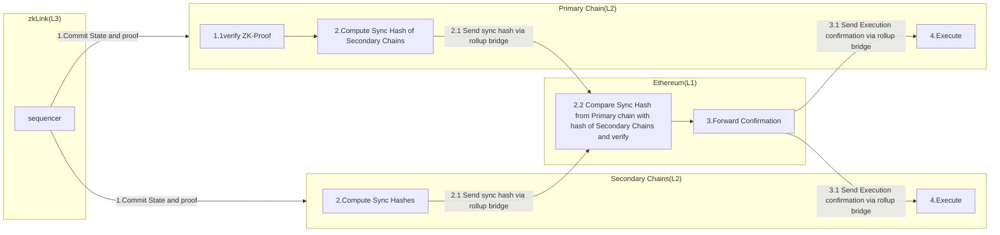
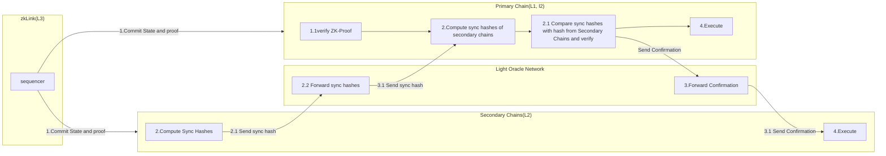

# ZkLink
## Overview

ZkLink is an aggregated rollup infrastructure that aims to address issues with increased costs & security risks associated with cross-chain transactions. ZkLink achieves this by building an aggregated rollup infrastructure to achieve cross-chain liquidity aggregation and simplify multi-chain dApp deployment. Through multi-chain state synchronization, dApps can securely access the liquidity from any connected chains.

# Key Features of zkLink Infrastructure:

- **Native Asset Aggregation**: Provides infrastructure with access to native tokens across connected L1s and L2s, allowing users to conduct multi-chain asset trade on a unified interface.
- **Low Fee and High Scalability**

## Architecture

In comparison to a classic ZK-Rollup architecture, zkLink proposes a new type of ZK-Rollup called an aggregated ZK-Rollup. In an aggregated zk-rollup, on-chain transactions (e.g., deposits) are relayed to the rollup network in real time. However, the hard finality of every transaction is determined by a new settlement paradigm called multi-chain settlement, which depends on the result of a ZKP verification and multi-chain state synchronization.

To optimize verification costs, only one chain among the connected chains will be designated as the primary chain responsible for the ZKP Verification. Other chains act as secondary chains that do not need to execute the ZKP verification. Through multi-chain state synchronization, zkLink achieves the equivalent of completing the ZKP verification on all chains.

# Stages of Aggregated ZK-Rollup:

1. **Commit**: The sequencer submits the zk-proof and transaction batch to the verifier contract on the primary chain.
2. **Prove**: The zkLink contract on the primary chain verifies the validity of the zk-proof.
3. **Synchronization**: Transaction sync hashes of secondary chains are forwarded to the primary chain via secure message channels. The primary chain verifies if sync hashes are consistent with the on-chain transactions previously relayed by the sequencer.
4. **Execution**: After receiving the batch root of transactions and the Merkle Proof for fund withdrawal, the withdrawal will be approved and executed.

# Multi-Chain State Synchronization

ZkLink proposes two solutions for guaranteeing state consistency between primary and secondary chains:

**ZkLink Nexus**

The Nexus settlement solution only connects Ethereum to its L2s. This solution settles the transactions and transition of states on Ethereum.

Firstly, the zkLink Nexus Sequencer will commit state and proof to the primary chain and secondary chains involved in the transaction. After the proof and transaction batch are committed and verified, the primary chain computes the sync hashes of the secondary chains through the transaction it received and sends it to the Ethereum contract. Likewise, the secondary chains compute their sync hashes and forward it to the Ethereum contract via the Ethereum L2s’ canonical message bridge.

Next, the Ethereum contract will compare the sync hashes sent from the primary and secondary chains. If they match, a confirmation message is sent to the contracts on both the primary and secondary chains via the rollup bridge for execution.

**ZkLink Origin**

Unlike the Nexus Solution, ZkLink Origin allows for integration with Alt-L1s like Solana and Avalanche, in addition to Ethereum and its L2s.

ZKLink Origin settles the transactions and transition of states on networks connected as long as one of the networks supports zk-SNARKs proof verification(which is a type of cryptographic proof that allows a prover to convince another the verifier that a statement is true without revealing any information about the statement itself).

ZkLink introduces a Light oracle Network for cross-chain message transfer to facilitate fast and secure communication between alt-Layer1’s, Ethereum, and Layer 2’s. The light oracle network consists of independent cross-chain general message service providers such as layerZero and Chainlink. which ensures the decentralization of the message transfer process.

Firstly, the ZkLink Origin Sequencer will commit state and proof to the primary chain and secondary chains involved in the transaction.

Then, the secondary chains will compute their sync hashes and send them to the primary chain via the light oracle network.

Next, the primary contract will compute the sync hashes of all secondary chains based on the transaction it received from the sequencer and compare the sync hashes from the secondary chain with what it has computed. If they match, confirmation messages are sent to the secondary chains through the light oracle network for execution.

## Advantages of the ZkLink Settlement Architectures

1. **Low Fee and High Scalability**: zkLink's modular stack provides unparalleled scalability for dApps. Zero-knowledge proof technology can dramatically reduce execution costs and provide a fast user experience.
2. **Security**: The use of zk-SNARKs provides strong cryptographic guarantees for the security and privacy of transactions.
3. **Efficiency**: The rollup design reduces the computational burden on the main chain, improving overall network performance.
4. **Privacy**: zk-SNARKs enhance transaction privacy by protecting user data.
5. **Reduced Fragmentation**: By aggregating liquidity from different chains, zkLink helps solve the fragmentation issue in DeFi.

## Disadvantages of the ZkLink Settlement Architectures

1. **Security Assumptions**: ZkLink's Origin process relies on assumptions about the Light Oracle Network and Sequencer.
2. **Cost of ZK Proof Generation**: Generating ZK proofs can be computationally intensive and costly, resulting in higher fees.
3. **Reliance on Multi-Chain Infrastructure**: If one of the connected chains has issues, it could impact the settlement process.
4. **Potential Latency**: Cross-chain communication and proof generation can introduce latency during congestion or operational delays.
